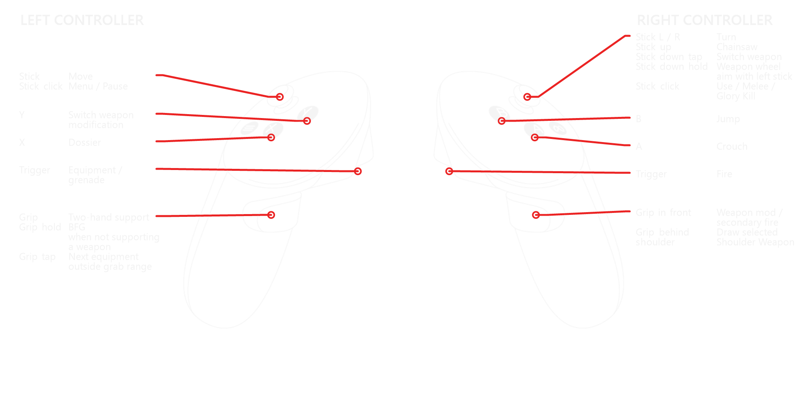

# KHARVOX


**A DOOM (2016) VR conversion mod**

KHARVOX is a total VR conversion for DOOM (2016). It adds room-scale 6DoF movement, tracked motion-controller input and stereoscopic VR rendering to the original campaign.

> The local 0.96 baseline uses SFS by default, with AER as fallback. Life and Ammo HUD panels can follow the offhand and be calibrated independently in game. A legal Steam version of DOOM (2016) is required. The game and its assets are not included.

## Installation

1. Download the latest KHARVOX release from the [GitHub Releases page](https://github.com/CactusVRStudios/KHARVOX/releases).
2. Extract the complete archive into a new folder of your choice. Do not run the launcher from inside the ZIP file, and do not copy KHARVOX into the DOOM installation folder.
3. Make sure DOOM (2016), your headset software and an OpenXR runtime such as SteamVR, Meta XR or VDXR are installed and ready.
4. Run `KharvoxLauncher.exe` from the extracted KHARVOX folder.

Keep all extracted KHARVOX files together in the same folder. Start DOOM through `KharvoxLauncher.exe` whenever you want to play in VR.

**Windows Defender / VirusTotal:** Windows Defender has been reported to flag `KharvoxGameIntro.exe` as `Trojan:Win32/Bearfoos.A!ml`. The [VirusTotal report for the bundled Beta 0.2 file](https://www.virustotal.com/gui/file/0ed398154a34a5c0b96db05ba2dc4815615ac128a56e3b188a27b6b9f43b4b45/detection), checked on September 10, 2026, shows **1 of 71 detections**, from Microsoft (`Trojan:Win32/Wacatac.B!ml`).

## Instructions

### General information and limitations

#### Known issues and limitations

**Works only with a legal Steam version of Doom 2016**

KHARVOX has been tested with the Steam release of DOOM (2016). It changes the game's rendering, camera and controls, so compatibility or startup issues may occur. Some hardware, including AMD graphics cards and less common headsets, may need additional setup. If a launch fails, close any remaining DOOM window and select **Launch Game** again.

Changing graphics quality while a level is loaded can freeze or crash the game. Change quality in the main menu before loading a level.

#### Best practice

- Use the **SFS** renderer. If it causes problems, select **AER** as fallback.
- Quest headsets should use Virtual Desktop or Meta Quest Link.
- Keep the DOOM game window in focus while playing. The launcher makes one focus attempt when the DOOM window becomes available and does not repeatedly reclaim focus. Click the status line beneath the launch button to bring a running game to the foreground manually.

For setup help, testing feedback and community support, visit the [Flat2VR Discord](https://discord.com/invite/ZFSCSDe).

### Controller bindings



#### Left controller

| Input | Action |
| --- | --- |
| Trigger | Equipment / grenade |
| Grip near support point | Two-hand support |
| Grip tap away from support point | Next equipment |
| Grip hold | BFG when not holding a weapon with two hands |
| X | Dossier |
| Y | Switch weapon modification |
| Stick | Move |
| Stick click | Menu / Pause |

#### Right controller

| Input | Action |
| --- | --- |
| Trigger | Fire |
| Grip in front | Weapon modification / alternate fire |
| Grip behind shoulder | Shoulder Weapon |
| A | Crouch |
| B | Jump |
| Stick left / right | Turn |
| Stick up | Chainsaw |
| Stick down, tap | Switch weapon |
| Stick down, hold | Weapon wheel; aim with the left stick |
| Stick click | Use / Melee / Glory Kill |

In menus, **A** confirms and **B** goes back. Full-screen interfaces preserve the selected handedness layout. Physical Glory Kills follow the launcher setting without replacing normal menu input.

#### Left Hand mode — Button swap

- Left Trigger and Grip become Fire and weapon modification; the left hand holds the weapon.
- Right Trigger and Grip become Equipment and two-hand support.
- Left Stick click becomes Use / Melee / Glory Kill; Right Stick click becomes Menu / Pause.
- Face buttons and stick axes stay in their standard physical positions.

#### Left Hand mode — Button and Stick swap

- Uses the trigger, grip and stick-click swap described above.
- Right Stick moves; Left Stick turns and controls weapon selection.
- Left Y jumps and Left X crouches.
- Right A opens the Dossier and Right B switches the weapon modification.

### Movement

Physical room-scale movement is translated into the game separately from stick locomotion.

#### Turn mode

- **Smooth:** continuous turning from 150°/s to 400°/s; the default is 230°/s.
- **Snap:** rotates by the configured angle each time the turn stick is pushed sideways.
- **Off:** disables artificial stick turning. Physical turning and room-scale movement remain available.

#### Movement direction

- **Head direction:** moving forward follows the horizontal headset direction. This is the default.
- **Off hand direction:** moving forward follows the horizontal aim direction of the non-weapon controller. Right-handed mode uses the left controller; Left Hand mode uses the right controller. Invalid tracking or a nearly vertical controller safely falls back to Head direction.

Left Hand mode moves the tracked weapon to the left hand and the support role to the right. **Button swap** keeps movement on the left stick and turning on the right. **Button and Stick swap** moves locomotion to the right stick and turning and weapon selection to the left stick, while moving face-button actions to the opposite controllers.

### Game options

#### Immersive Mode

Keeps supported Glory Kills, traversal sequences, tutorials and cinematics in stereoscopic VR instead of presenting the complete frame on a flat Cine Window. This is more immersive, but authored camera motion can be uncomfortable.

- **Freelook in cinematics and Glory Kills:** headset rotation controls the view while the authored sequence continues.
- **Regular cinematics in Cine Window:** interactive VR moments remain immersive, while regular scripted cinematics use the comfort window.

#### Cine Window follows headset

Makes the virtual screen used for cinematics follow your headset. When disabled, the screen stays in a fixed position. Menus and other VR elements are unaffected.

#### Physical Glory Kills

A forward punch from the selected hand or hands can trigger Melee / Glory Kill. The threshold ranges from 1.0 m/s to 4.0 m/s in 0.2 m/s steps and defaults to 2.8 m/s. Move it toward **Fast** if normal hand movement causes accidental attacks.

#### Shoulder Weapon

Move the weapon hand behind its matching shoulder and make a fresh Grip press. If the selected weapon is unavailable or empty, KHARVOX tries the Combat Shotgun and then the Pistol. It never unlocks or grants a weapon.

#### Enable Hands

Shows static controller hands during gameplay. Enabled by default in all profiles. Hands are hidden during supported cinematics and transitions, and Left Hand mode mirrors the weapon and support hands.

#### Hands Jump

Raise both hands to jump. Enabled by default in all profile presets; you can switch it off in the launcher. You can still use the jump button. Works with either renderer, even when hand models are hidden. Disabled in menus and cinematics.

#### Virtual Gunstock

Adds a headset-relative rear anchor to calibrated two-handed, barrel-aligned weapons after the support grip is acquired. This can make long-range aiming steadier while preserving tracked controller movement.

#### Laser sight

Projects an aiming line from the rendered muzzle of supported firearms. It has no effect on weapon accuracy or projectile behavior.

### Rendering

**SFS is the default renderer for all profiles and first launch. AER remains available as fallback.**

SFS produces both eye views from one game frame through the KHARVOX Vulkan render path and submits them through OpenXR. Menus use the shared quad presentation. HUD, cinematic options and FSR are managed by the launcher. Resolution changes require restarting the game. See [SFS development and build notes](Docs/VULKAN_SFS_096.md).

#### Render Scale

Render scale adjusts the resolution used to render the game. Higher values can improve clarity but demand more GPU power; lower values can improve performance at the cost of detail. The maximum supported resolution depends on your graphics card and VR runtime. Restart the game after changing this setting.

#### FSR Upscaling

- With Meta XR, VDXR or SteamVR, select the default SFS renderer, choose a Render Scale below 100%, and enable **Use FSR Upscaling**.
- Start at 80%. Lower values reduce more source-pixel work but also lose fine detail.
- FSR remains inactive at 100% or higher. Below 100%, verify **FSR1 active** in the launcher status line.

Recommended runtime starting points:

- Quest / Pico: Virtual Desktop with VDXR
- Valve Index / PSVR2: SteamVR

Use the highest stable headset refresh rate your system can sustain. Every KHARVOX launch disables DOOM's native Motion Blur, automatic Glory Kill Motion Blur and Chromatic Aberration. These temporary VR-safe overrides do not replace the encrypted DOOM user profile or campaign saves.

### bHaptics

bHaptics feedback requires compatible gear and the [bHaptics Player for Windows](https://www.bhaptics.com/support/downloads/?type=bhaptics_player). Pair and verify the devices in the Player before starting the game.

**Enable bHaptics** may remain selected without connected hardware. Missing equipment, an unavailable Player or a local bridge error does not block DOOM; normal controller rumble remains independent.

### PSVR2 Toolkit

**Use PSVR2 Toolkit** is experimental and works only with PlayStation VR2 hardware. It requires PSVR2 Toolkit 1.0 or later and a working PSVR2 SteamVR setup. KHARVOX applies weapon-specific adaptive-trigger resistance to the weapon hand; the support hand remains disabled and normal controller rumble is unaffected. Missing or inactive Toolkit software never blocks game startup.

Install and update [PSVR2 Toolkit](https://github.com/BnuuySolutions/PSVR2Toolkit) separately. Support is available through the [PSVR2 Toolkit Discord](https://discord.gg/jym8CgJPF3).

### About

KHARVOX is an independent community project and is not affiliated with, endorsed by or sponsored by the publishers or developers of supported games. All trademarks and product names are the property of their respective owners.

Made by Cactus.

**Contributors:** [Cabalistic](https://github.com/fholger), [Dilshan](https://dilshanvisuals.com) and TinyBlackDog.

**Thanks:** Crementif, Hoshi82, Galaghan, thefreemike, nabelo, VR DaD, Tino, Vince Crusty, BaggyG and Team Beef.

## Building from source

### Requirements

- Windows 10 or Windows 11, x64
- CMake 3.20 or newer
- Visual Studio with **Desktop development with C++** and a Windows SDK
- .NET SDK with the .NET Framework 4.8 targeting pack

Clone the repository and its optional PSVR2 Toolkit source link:

```powershell
git clone --recurse-submodules https://github.com/CactusVRStudios/KHARVOX.git
cd KHARVOX
```

Configure and build the native layer and bridges outside the source tree:

```powershell
cmake -S . -B ..\kharvox-build\native -A x64 -DKHARVOX_BUILD_LAYER=ON -DBUILD_TESTING=ON
cmake --build ..\kharvox-build\native --config Release --parallel
```

Build the launcher:

```powershell
dotnet restore launcher\KharvoxLauncher\KharvoxLauncher.csproj
dotnet build launcher\KharvoxLauncher\KharvoxLauncher.csproj --configuration Release --no-restore
```

Run the native tests:

```powershell
ctest --test-dir ..\kharvox-build\native -C Release --output-on-failure
```

The PSVR2 bridge is optional. CMake builds it only when the linked PSVR2 Toolkit headers are available under `tools/PSVR2Toolkit`. A clone without submodules still builds the rest of KHARVOX.

## Source tree

- `src/` — Vulkan/OpenXR compatibility layer and optional native bridges
- `launcher/` — Windows launcher source
- `config/` — default calibration and weapon profiles
- `tests/` — automated tests
- `third-party/` — vendored interfaces and permitted runtime components

## Legal and licensing

KHARVOX is not affiliated with, endorsed by or sponsored by Bethesda Softworks, id Software, ZeniMax Media or their affiliates. DOOM and related names and marks are trademarks of their respective owners. A legally acquired installation of DOOM (2016) is required.

The repository contains no DOOM executable, game data, extracted assets, DRM material, official artwork, audio or fonts.

Original KHARVOX code is released under the [MIT License](LICENSE.txt). Bundled and externally linked third-party material remains under its own licenses and notices; see [THIRD_PARTY_NOTICES.txt](Docs/THIRD_PARTY_NOTICES.txt).

KHARVOX performs no update checks, telemetry uploads, crash-report uploads or external downloads. Local configuration and diagnostic data remain on the user's computer unless the user chooses to share them.

KHARVOX logs are written to `%TEMP%`, including `KHARVOX-NATIVE-STEREO.log` and `KHARVOX-VR-INTRO.log`. Additional native diagnostic captures are stored in `%TEMP%/KHARVOX-Diagnostics`. Calibration and launcher status files remain with the runtime.
